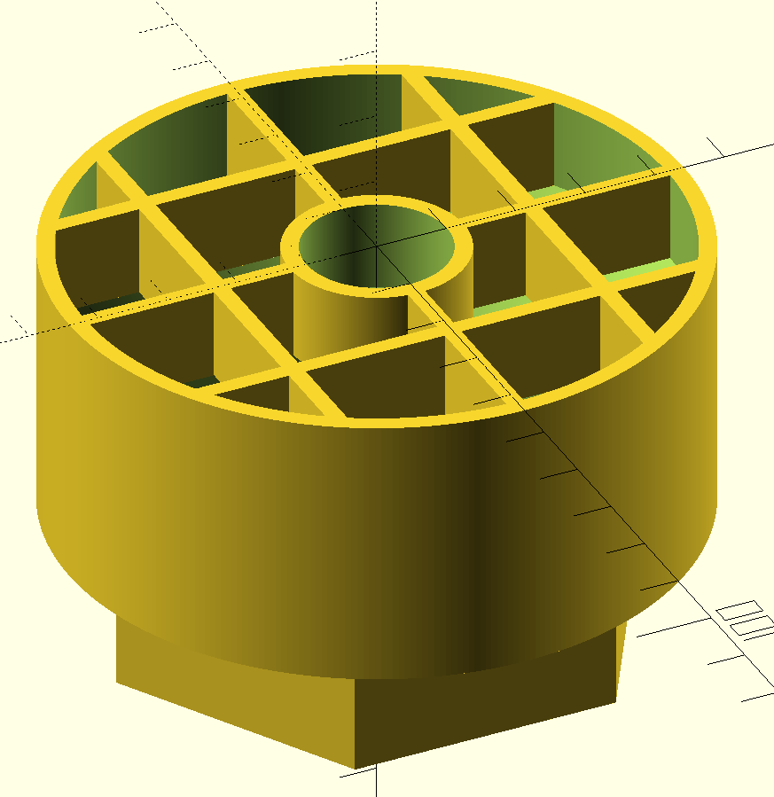

# Stormwater Grate

A grate to sit atop a storm water pipe, with a central opening to take a hose (e.g. from a first-flush diverter runoff).

You can customise the variables in the `design.scad` and create your own version to suit your usage.
